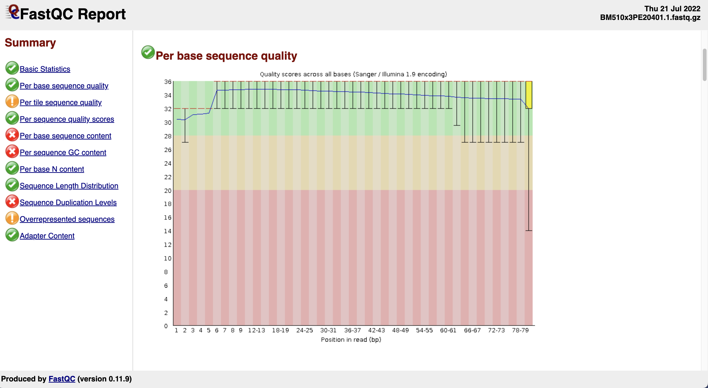
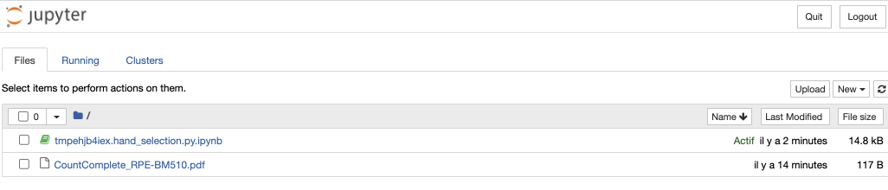
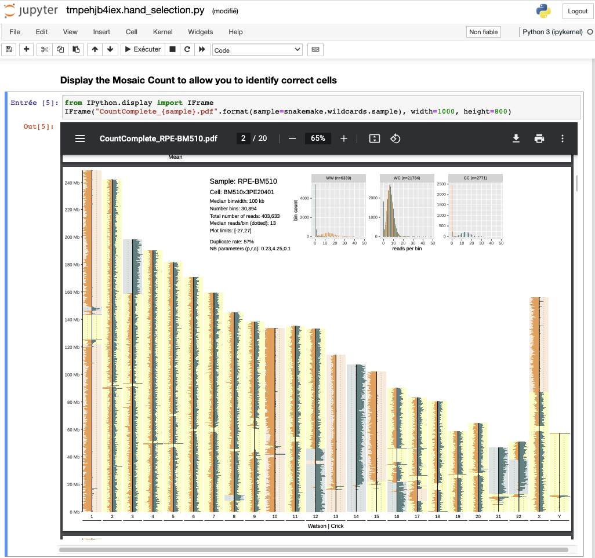
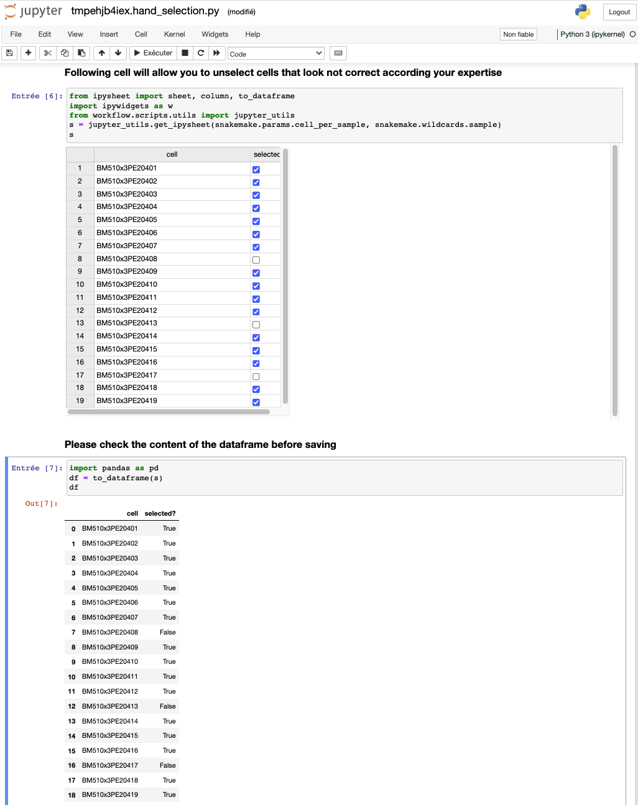

[](https://github.com/friendsofstrandseq/ashleys-qc-pipeline/actions/workflows/main.yaml)
[](https://snakemake.github.io)

---

Strand-Seq Quality Control Pipeline based on ashleys-qc

---

# Overview of this workflow

This workflow uses [Snakemake](https://github.com/snakemake/snakemake) perform Quality Control analysis on Strand-Seq single-cell
sequencing data. The starting point are single-cell FASTQ files from Strand-seq experiments and the final output produced is a folder with clean selected BAM files. The pipeline can identify automatically high-quality libraries through ML-based analysis tool [ashleys-qc](https://github.com/friendsofstrandseq/ashleys-qc). Thus, the workflow goes through the following steps:

1. FASTQ sequencing Quality Control through [FastQC](https://www.bioinformatics.babraham.ac.uk/projects/fastqc/)
2. Mapping FASTQ against a reference genome throught [BWA](http://bio-bwa.sourceforge.net/)
3. Sorting, Deduplicating and Indexing of BAM files through [Samtools](http://www.htslib.org/) & [sambaba](https://lomereiter.github.io/sambamba/docs/sambamba-view.html)
4. Generating features and use [ashleys-qc](https://github.com/friendsofstrandseq/ashleys-qc) model to identify high-quality cells

# Quick Start on example data

0. [Optional] Install [Singularity](https://www.sylabs.io/guides/3.0/user-guide/)

1. Install snakemake through conda

```bash
conda create -n snakemake -c defaults -c anaconda -c conda-forge -c bioconda snakemake && conda activate snakemake
```

2. Clone the repository

```bash
git clone --recurse-submodules https://github.com/friendsofstrandseq/ashleys-qc-pipeline.git && cd ashleys-qc-pipeline
```

3. Run on example data on only one small chromosome (`<disk>` must be replaced by your disk letter/name, `/g` or `/scratch` at EMBL for example)

```bash
snakemake --cores 6 --configfile .tests/config/simple_config.yaml --profile workflow/snakemake_profiles/local/conda_singularity --singularity-args "-B /<disk>:/<disk>"
```

4. Run your own analysis **locally** (`<disk>` must be replaced by your disk letter/name, `/g` or `/scratch` at EMBL for example)

```bash
snakemake --cores 6 --config data_location=<PATH> --profile workflow/snakemake_profiles/local/conda_singularity --singularity-args "-B /<disk>:/<disk>" --latency-wait 60
```

---

**ℹ️ Note**

- Steps 0 - 2 are required only during first execution
- After the first execution, do not forget to go in the git repository and to activate the snakemake environment

---

---

**ℹ️ Note for 🇪🇺 EMBL users**

- You can load already installed snakemake modusl on the HPC (by connecting to login01 & login02) using the following `module load snakemake/7.14.0-foss-2022a`
- Use the following command for singularity-args parameter: `--singularity-args "-B /g:/g -B /scratch:/scratch"`

---

# 🔬​ Start running your own analysis

## Directory structure

The ashleys-qc-pipeline takes as input Strand-Seq fastq file following the structure below:

```bash
Parent_folder
|-- Sample_1
|   `-- fastq
|       |-- Cell_01.1.fastq.gz
|       |-- Cell_01.2.fastq.gz
|       |-- Cell_02.1.fastq.gz
|       |-- Cell_02.2.fastq.gz
|       |-- Cell_03.1.fastq.gz
|       |-- Cell_03.2.fastq.gz
|       |-- Cell_04.1.fastq.gz
|       `-- Cell_04.2.fastq.gz
|
`-- Sample_2
    `-- fastq
        |-- Cell_21.1.fastq.gz
        |-- Cell_21.2.fastq.gz
        |-- Cell_22.1.fastq.gz
        |-- Cell_22.2.fastq.gz
        |-- Cell_23.1.fastq.gz
        |-- Cell_23.2.fastq.gz
        |-- Cell_24.1.fastq.gz
        `-- Cell_24.2.fastq.gz
```

Thus, in a `Parent_Folder`, create a subdirectory `Parent_Folder/sampleName/` for each `sample`. Each Strand-seq FASTQ files of this sample need to go into the `fastq` folder and respect the following syntax: `<CELL>.<1|2>.fastq.gz`, `1|2` corresponding to the pair identifier.

## Execution

The `--profile` argument will define whether you want to execute the workflow locally on your laptop/desktop (`workflow/snakemake_profiles/local/conda_singularity/`), or if you want to run it on HPC. A generic slurm profile is available (`workflow/snakemake_profiles/HPC/slurm_generic/`).

Local execution (not HPC or cloud):

```bash
snakemake \
    --cores <N> --config data_location=<DATA_FOLDER> \
    --profile workflow/snakemake_profiles/local/conda_singularity/ \
    --singularity-args "-B /<disk>:/<disk>"
```

HPC execution (require first that you modify the workflow/snakemake_profiles/HPC/slurm_generic/config.yaml for your own cluster)

```bash
snakemake \
    --config data_location=<DATA_FOLDER> \
    --profile workflow/snakemake_profiles/HPC/slurm_generic/ \
    --singularity-args "-B /<disk>:/<disk>"
```

EMBL HPC execution (disks binding points already set in the snakemake profile)

```bash
snakemake \
    --config data_location=<DATA_FOLDER> \
    --profile workflow/snakemake_profiles/HPC/slurm_EMBL/
```

### GeneCore execution (EMBL)

genecore option allows EMBL users to directly run ashleys-qc-pipeline on genecore shared folders containing sequencing runs. Run folder usually contains multiple plate that were sequenced.
Here, Snakemake will automatically create a parent folder corresponding to the genecore_date_folder under the data_location directory and a subfolder for each plate/sample that was sequenced.
Each sample directory will contained an additional folder listing the symbolic links pointing to the raw data produced by the facility.

**Example:**

```bash
snakemake \
    --config genecore=True genecore_date_folder=2022-12-01-H35CNAFX5 data_location=<DATA_FOLDER> \
    --profile workflow/snakemake_profiles/HPC/slurm_EMBL/
```

## Pipeline update procedure

If you already use a previous version of mosaicatcher-pipeline, here is a short procedure to update it:

- First, update all origin/<branch> refs to latest:

`git fetch --all`

- Jump to a new version (here 1.3.5) & pull code:

`git checkout 1.3.5 && git pull`

Then, to initiate or update git snakemake_profiles submodule:

`git submodule update --init --recursive`

---

# Parameters

## MosaiCatcher arguments

---

**ℹ️ Note**

All these arguments can be specified in two ways:

1. In the config/config.yaml file, by replacing existing values
2. Using the `--config` snakemake argument (`--config` must be called only one time with all the arguments behind it, e.g: `--config data_location=<INPUT>`)

---

### Parameters

The list of parameters is available through the command: `snakemake -c1 --config list_commands=True`

| Parameter            | Comment                                                                                                                                                        | Default            | Experimental | Other choices |
| -------------------- | -------------------------------------------------------------------------------------------------------------------------------------------------------------- | ------------------ | ------------ | ------------- |
| `data_location`      | Path to parent folder containing samples                                                                                                                       | .tests/data_CHR17/ |              |               |
| `email`              | Email address for completion summary                                                                                                                           | None               |              |               |
| `reference`          | Reference genome                                                                                                                                               | hg38               |              | hg19, T2T     |
| `hand_selection`     | Allow to identify manually high-quality strand-seq libraries.                                                                                                  | False              | X            |               |
| `GC_analysis`        | Enable/Disable GC analysis and correction of Strand-Seq libraries libraries.                                                                                   | False              |              |               |
| `GC_rowcol_analysis` | Enable / Disable GC row condition analysis                                                                                                                     | False              |              |               |
| `FastQC_analysis`    | Enable / Disable FastQC analysis                                                                                                                               | False              |              |               |
| `plate_orientation`  | If GC_analysis enabled and conditions tested by rows/columns, set the orientation (landscape/portrait) to perform a row/column-wise analysis of the libraries. | landscape          |              |               |
| `ashleys_threshold`  | Ashleys-qc threshold for binary classification of low/good quality cells                                                                                       | 0.5                |              |               |
| `window`             | Window size used for binning by mosaic count (Can be of high importance regarding library coverage)                                                            | 200000             |              |               |
| `chromosomes`        | List of chromosomes to be processed in the pipeline                                                                                                            | chr1..22,chrX      |              |               |

### EMBL parameters

| Parameter              | Comment                                                                                                                             | Parameter type | Default |
| ---------------------- | ----------------------------------------------------------------------------------------------------------------------------------- | -------------- | ------- |
| `genecore`             | Enable/disable genecore mode to give directly the genecore run folder (genecore_date_folder)                                        | Boolean        | False   |
| `genecore_date_folder` | Genecore folder name to be process (Ex: "2022-11-02-H372MAFX5")                                                                     | String         | ""      |
| `samples_to_process`   | List of samples to be processed in the folder (default: all samples ; sample is defined by the name between "\*\_lane1" and "PE20") | List           | []      |

## Snakemake arguments

Here are presented some essential snakemake options that could help you.

```
--cores, -c
```

Use at most N CPU cores/jobs in parallel. If N is omitted or ‘all’, the limit is set to the number of available CPU cores. In case of cluster/cloud execution, this argument sets the number of total cores used over all jobs (made available to rules via workflow.cores).

```
--printshellcmds, -p
```

Recommended to print out the shell commands that will be executed.

```
--use-conda
```

If defined in the rule, run job in a conda environment. If this flag is not set, the conda directive is ignored and use the current environment (and path system) to execute the command.

```
--conda-frontend [mamba|conda]
```

Choose the conda frontend for installing environments. Mamba is much faster and highly recommended but could not be installed by default on your system. Default: “conda”

```
--use-singularity
```

If defined in the rule, run job within a singularity container. If this flag is not set, the singularity directive is ignored.

```
--singularity-args "-B /mounting_point:/mounting_point"
```

Pass additional args to singularity. `-B` stands for binding point between the host and the container.

```
--dryrun, -n
```

Do not execute anything, and display what would be done. If you have a very large workflow, use –dry-run –quiet to just print a summary of the DAG of jobs.

```
--rerun-incomplete, --ri
```

Re-run all jobs the output of which is recognized as incomplete.

```
--keep-going, -k
```

Go on with independent jobs if a job fails.

```
-T, --retries, --restart-times
```

Number of times to restart failing jobs (defaults to 0).

```
--forceall, -F
```

Force the execution of the selected (or the first) rule and all rules it is dependent on regardless of already created output.

---

**ℹ️ Note**

Currently, the binding command needs to correspond to the mounting point of your system (i.e: "/tmp:/tmp").
On seneca for example (EMBL), use `"/g:/g"` if you are working on `/g/korbel[2]` or `"/scratch:/scratch"` if you plan to work on `scratch`.

---

Obviously, all other [snakemake CLI options](https://snakemake.readthedocs.io/en/stable/executing/cli.html) can also be used.

## Output

### FastQC files

---

File path: `<FOLDER>/<SAMPLE>/fastqc/<CELL>.[1|2].[html|zip]`

---

You will be able to find all QC analysis of raw FastQ files in the path above.



### ashleys-qc prediction

---

File path: `<FOLDER>/<SAMPLE>/predictions/predictions.tsv`

---

Ashleys predictions can be found at the path above.

Predictions table are composed of 3 columns: the cell name, the binary prediction (1: Selected, 0: Unselected) and the associated probability of the SVC model (normal model with a binary cutoff of 0.5).

| cell                         | prediction | probability |
| ---------------------------- | ---------- | ----------- |
| BM510x3PE20405.sort.mdup.bam | 0          | 0           |
| BM510x3PE20413.sort.mdup.bam | 0          | 0.43        |
| BM510x3PE20409.sort.mdup.bam | 0          | 0.32        |
| BM510x3PE20414.sort.mdup.bam | 1          | 0.85        |
| BM510x3PE20412.sort.mdup.bam | 0          | 0.29        |
| BM510x3PE20418.sort.mdup.bam | 1          | 0.84        |
| BM510x3PE20401.sort.mdup.bam | 1          | 0.87        |
| BM510x3PE20408.sort.mdup.bam | 1          | 0.88        |
| BM510x3PE20410.sort.mdup.bam | 1          | 0.93        |
| BM510x3PE20407.sort.mdup.bam | 1          | 0.89        |
| BM510x3PE20402.sort.mdup.bam | 1          | 0.95        |
| BM510x3PE20411.sort.mdup.bam | 1          | 0.91        |
| BM510x3PE20404.sort.mdup.bam | 1          | 0.89        |
| BM510x3PE20416.sort.mdup.bam | 1          | 0.84        |
| BM510x3PE20406.sort.mdup.bam | 1          | 0.91        |
| BM510x3PE20417.sort.mdup.bam | 1          | 0.93        |
| BM510x3PE20403.sort.mdup.bam | 1          | 0.91        |
| BM510x3PE20415.sort.mdup.bam | 1          | 0.9         |
| BM510x3PE20419.sort.mdup.bam | 1          | 0.91        |

### BAM selected folder

Selected libraries BAM files can be retrieved at the path above and can be used as an input for the [mosaicatcher-pipeline](https://github.com/friendsofstrandseq/mosaicatcher-pipeline.git).

## Roadmap

### Major features

- [x] Jupyter Notebook hand selection of cells ([1.2.1](https://github.com/friendsofstrandseq/ashleys-qc-pipeline/releases/tag/1.2.1))
- [x] HTML report ([1.2.1](https://github.com/friendsofstrandseq/ashleys-qc-pipeline/releases/tag/1.2.1))
- [x] GC analysis module ([1.3.1](https://github.com/friendsofstrandseq/ashleys-qc-pipeline/releases/tag/1.3.1))
- [x] Multiple FASTA reference ([1.3.5](https://github.com/friendsofstrandseq/ashleys-qc-pipeline/releases/tag/1.3.5))
- [x] (EMBL) GeneCore mode of execution: allow selection and execution directly by specifying genecore run folder (2022-11-02-H372MAFX5 for instance) ([1.3.5](https://github.com/friendsofstrandseq/ashleys-qc-pipeline/releases/tag/1.3.5))
- [x] Automatic bypass of the positive control in ashleys labels (through z-score distribution analysis) ([1.3.6](https://github.com/friendsofstrandseq/ashleys-qc-pipeline/releases/tag/1.3.6))

### Minor features

- [x] replace `input_bam_location` by `data_location` (harmonization with [mosaicatcher-pipeline](https://github.com/friendsofstrandseq/mosaicatcher-pipeline.git)) ([1.3.1](https://github.com/friendsofstrandseq/ashleys-qc-pipeline/releases/tag/1.3.1))
- [x] Ashleys custom threshold parameter ([1.3.4](https://github.com/friendsofstrandseq/ashleys-qc-pipeline/releases/tag/1.3.4))
- [x] Aesthetic start + mail logging ([1.3.5](https://github.com/friendsofstrandseq/ashleys-qc-pipeline/releases/tag/1.3.5))
- [x] Plate plot ([1.3.5](https://github.com/friendsofstrandseq/ashleys-qc-pipeline/releases/tag/1.3.5)
- [x] Jupyter Notebook update ([1.3.6](https://github.com/friendsofstrandseq/ashleys-qc-pipeline/releases/tag/1.3.6)
- [x] List of commands available through list_commands parameter ([1.3.6](https://github.com/friendsofstrandseq/ashleys-qc-pipeline/releases/tag/1.3.6)
- [x] `FastQC_analysis` boolean `GC_rowcol_analysis` parameters to enable/disable optional modules ([1.3.6](https://github.com/friendsofstrandseq/ashleys-qc-pipeline/releases/tag/1.3.6)

### Experimental feature: hand-selection of cells via Jupyter notebook

---

**ℹ️ Note**

Singularity execution (`--use-singularity`) is <del>not</del> **NOW** available for this mode, as well as HPC execution. (The jupyter notebook rule was flagged as part of the snakemake localrule statement and will bypass container execution through `container: none` statement.

---

If you wish to identify yourself the cells that seem uncorrect according to your expertise, you can use the experimental interactive Jupyter Notebook by passing to the config argument `hand_selection=True`.
By enabling this feature, the pipeline will run fire a Jupyter Notebook for analysis afterwards QC plot creation and ashleys prediction.

---

**⚠️ Warning**

If you are running the pipeline remotely and not on your local computer, you need first to open a [SSH tunnel (with Local Forwarding to port 5500)](https://www.ssh.com/academy/ssh/tunneling/example#local-forwarding) in order to access the Jupyter Notebook webpage.

---

The following command, including snakemake `--notebook-listen` (allow to chose the port oppened: arbitrary selected to 5500) and `--edit-notebook` (fire a jupyter server that allow graphical interaction instead of directly run the complete notebook) arguments, need to be passed to test this feature:

```bash
snakemake --cores 12 --profile workflow/snakemake_profiles/local/conda --config hand_selection=True data_location=<INPUT> \
  --notebook-listen localhost:5500 --edit-notebook <DATA_FOLDER>/<SAMPLE>/cell_selection/labels_raw.tsv
```

Then, you can accessing Jupyter Notebook with your favorite web browser through the following URL `http://localhost:5500` (token available in the terminal) or by clicking directly on the web link in the terminal itself.

You will need to open the following untitled with the following pattern : `tmp[XXX].hand_selection.py.ipynb` and follow the instructions inside it.

Instructions listed in the notebook are also listed here:

---

#### _Jupyter Notebook instructions_

1. Run first the top cell (enable to use snakemake arguments)
2. Follow the different cells
   1. Symlink PDF plots to jupyter nb directory
   2. Enable jupyter widgets
   3. Display Mosaic Count PDF inside Jupyter Notebook
   4. Display graphical table to allow you to unselect low-quality libraries (that will be not processed in the remaining analysis)
      _Please <ins>do not</ins> RE-select cells that were automatically unselected cells (corresponding to low-coverage by [mosaicatcher](https://github.com/friendsofstrandseq/mosaicatcher) count program and not possible to process by the pipeline)_
   5. Export to pandas dataframe
   6. Save & clean data
3. File > Close and Halt
4. Click on Quit (top right)
5. Close the webpage

---







However, as the previous command point to a specific output file related to the Jupyter Notebook snakemake rule, the snakemake command need to be runned again as the following to complete its execution (current snakemake limitation (7.9.0)).

Thus, after closing the notebook, run the following commands:

```bash
# Fix snakemake issue regarding metadata & incomplete jobs (to remove when solved)
rm .snakemake/incomplete/
```

```bash
# Snakemake > 7.8 changes its rerun behavior. Before, rerunning jobs relied purely on file modification times. https://github.com/snakemake/snakemake/issues/1694
# Run snakemake touch function to prevent timestamps errors
snakemake --cores 12 --use-conda --config hand_selection=True data_location=<DATA_FOLDER> --touch
```

```bash
snakemake --cores 12 --use-conda --config hand_selection=True data_location=<DATA_FOLDER>
```

# Authors (alphabetical order)

## Contributors

- Ebert Peter
- Grimes Karen
- Gros Christina
- Korbel Jan
- Marschall Tobias
- Sanders Ashley
- Weber Thomas (maintainer and current developer)

# References

> Gros, Christina, Ashley D Sanders, Jan O Korbel, Tobias Marschall, and Peter Ebert. “ASHLEYS: Automated Quality Control for Single-Cell Strand-Seq Data.” Bioinformatics 37, no. 19 (October 1, 2021): 3356–57. https://doi.org/10.1093/bioinformatics/btab221.
